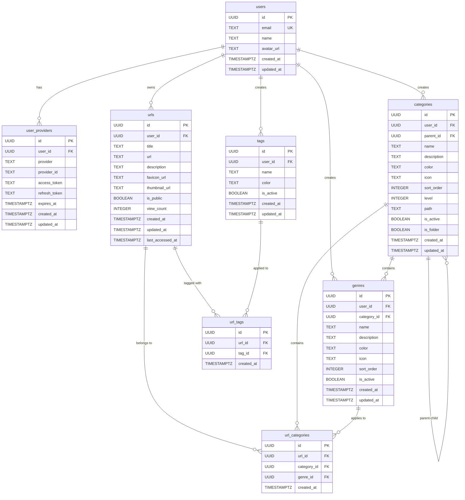

# URL保管アプリ データベース設計 ER図（フォルダ機能対応）

## 概要

URL保管アプリのための最適化されたデータベース設計です。フォルダ機能（カテゴリの階層化）を実装し、カテゴリ内にジャンルを配置、タグは独立して柔軟に使用できます。

## テーブル一覧

### 基本テーブル

- **users** - ユーザー情報
- **user_providers** - OAuth認証プロバイダー情報

### URL管理テーブル

- **urls** - URLの基本情報
- **categories** - カテゴリマスタ（階層化対応、フォルダ機能）
- **genres** - ジャンルマスタ（カテゴリに紐づけ）
- **tags** - タグマスタ（独立、自由な分類）

### 関連テーブル

- **url_categories** - URLとカテゴリ・ジャンルの関連
- **url_tags** - URLとタグの多対多関係

## ER図

## 設計の特徴

### 1. 正規化設計

- 第3正規形まで正規化
- データの重複を最小限に抑制
- 更新時の整合性を保証

### 2. 階層化された分類システム

- **カテゴリ（フォルダ）**: 階層化された大分類（例：技術 >
  Web開発 > フロントエンド）
- **ジャンル**: カテゴリ内の中分類（例：React、Vue.js、Angular）
- **タグ**: 独立した自由な分類（例：#重要、#後で読む、#学習中）

### 3. パフォーマンス最適化

- 適切なインデックス設計
- 部分インデックス（WHERE句付き）
- 多言語全文検索対応（日本語・英語・多言語）
- 自動言語判定による最適化された検索

### 4. スケーラビリティ

- UUID使用による分散対応
- ユーザー別のデータ分離
- 論理削除（is_active）による履歴保持

### 5. セキュリティ

- 外部キー制約による参照整合性
- カスケード削除によるデータ整合性
- ユーザー別のデータアクセス制御

## インデックス戦略

### 検索最適化

- ユーザー別検索用インデックス
- 多言語全文検索用GINインデックス（日本語・英語・多言語）
- 自動言語判定による最適化された検索
- ソート用複合インデックス

### パフォーマンス向上

- 部分インデックス（アクティブなレコードのみ）
- カバリングインデックス
- 統計情報の最適化

## ビュー設計

### 1. url_details

- URLの詳細情報をカテゴリ、ジャンル、タグと結合
- アプリケーションでの表示用

### 2. user_stats

- ユーザーの統計情報
- ダッシュボード表示用

### 3. popular_urls

- 人気の公開URL
- トップページ表示用

### 4. category_hierarchy

- カテゴリの階層構造表示
- フォルダ機能のUI用

### 5. genre_with_category

- ジャンルとカテゴリ情報の統合表示
- ジャンル管理UI用

### 6. multilingual_search_results

- 多言語対応の統合検索結果
- 横断検索機能用

### 7. language_statistics

- 言語別のコンテンツ統計
- 多言語使用状況の分析用

## 運用考慮事項

### データベース設定

- PostgreSQL 13以上推奨
- 多言語全文検索対応（日本語・英語）
- 適切なメモリ設定
- 全文検索用の設定最適化

### バックアップ戦略

- 定期的なフルバックアップ
- WAL（Write-Ahead Logging）有効化
- ポイントインタイムリカバリ対応

### 監視項目

- クエリパフォーマンス
- インデックス使用率
- ディスク使用量
- 接続数

## 拡張性

### 将来の機能追加

- コメント機能
- お気に入り機能
- 共有機能の拡張
- カテゴリの移動・並び替え機能
- バルク操作機能
- 多言語UI対応
- 翻訳機能
- 言語別の統計ダッシュボード

### スケールアウト対応

- 読み取りレプリカ
- パーティショニング
- シャーディング
